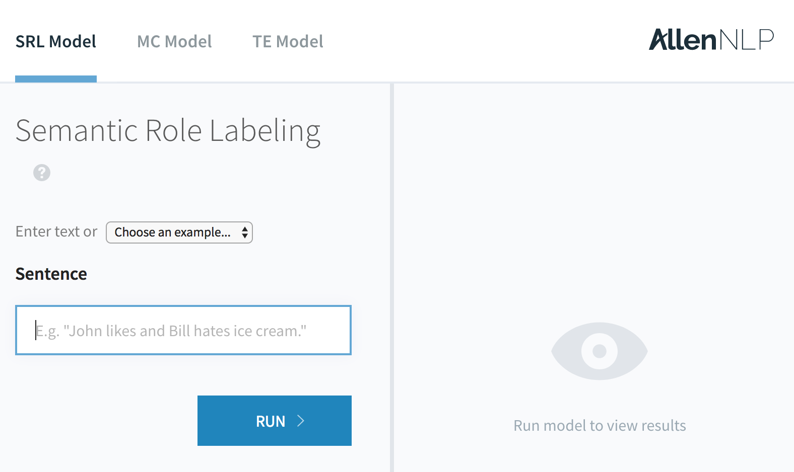

Welcome to AllenNLP!

## Installing using Docker

The easiest way to get started is using Docker. Assuming you have Docker installed, just run

```bash
$ docker run -p 8000:8000 -it --rm allennlp/allennlp
```

This will download the latest `allennlp` image to your machine
(unless you already have it),
start a Docker container, and launch an interactive shell.
It also exposes port 8000, which is where the demo server runs,
and shuts down the container when you exit the interactive shell.

## Installing using pip

You can install `allennlp` using pip. Create a Python 3.6 virtual environment, and run

```bash
$ pip install allennlp
```

You'll also need to install PyTorch 0.2, following the appropriate instructions
for your platform from [their website](http://pytorch.org/).

Finally, you'll need to download spaCy's English models:

```bash
$ python -m spacy download en
```

This is the least-battle-tested method of installation,
so please let us know if anything doesn't work right.

## Installing from source

A third alternative is to clone from our git repository:

```bash
$ git clone https://github.com/allenai/allennlp.git
```

Create a Python 3.6 virtual environment, and run

```bash
$ INSTALL_TEST_REQUIREMENTS=true scripts/install_requirements.sh
```

changing the flag to `false` if you don't want to be able to run tests.
(Narrator: You want to be able to run tests.)

You'll also need to install PyTorch 0.2, following the appropriate instructions
for your platform from [their website](http://pytorch.org/).

## Once You've Installed

If you just want to use the models and helper classes that are included with AllenNLP,
you can use the included "run" script, which provides a command-line interface to
common functionality around training and evaluating models.

```
$ python -m allennlp.run
usage: run.py [command]

Run AllenNLP

optional arguments:
  -h, --help  show this help message and exit

Commands:

    predict   Use a trained model to make predictions.
    train     Train a model
    serve     Run the web service and demo.
    evaluate  Evaluate the specified model + dataset
```

It's what we'll be using throughout this tutorial.

Eventually you'll want to create your own models and helper classes,
at which point you'll need to create your own run script that knows
about them.

### Serving the Demo

The `serve` command starts the demo server.
The first time you run it, it will download
several large serialized models from Amazon S3.

```
$ python -m allennlp.run serve
Starting a sanic server on port 8000.
[... lots of logging omitted ...]
2017-08-16 18:55:12 - (sanic)[INFO]: Goin' Fast @ http://0.0.0.0:8000
2017-08-16 18:55:12,321 - INFO - sanic - Goin' Fast @ http://0.0.0.0:8000
2017-08-16 18:55:12 - (sanic)[INFO]: Starting worker [33290]
2017-08-16 18:55:12,323 - INFO - sanic - Starting worker [33290]
```

(Currently `serve` doesn't work if you installed using `pip`,
 as the static files for the demo website don't get installed. We're working on it.)

If you now visit `http://localhost:8000` in your browser, you can play around with the same demo
that runs on the AllenNLP website.



### Next Steps

Continue on to the [Training and Evaluating Models](training-and-evaluating) tutorial.
