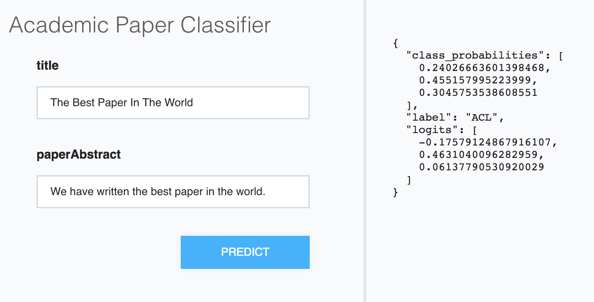
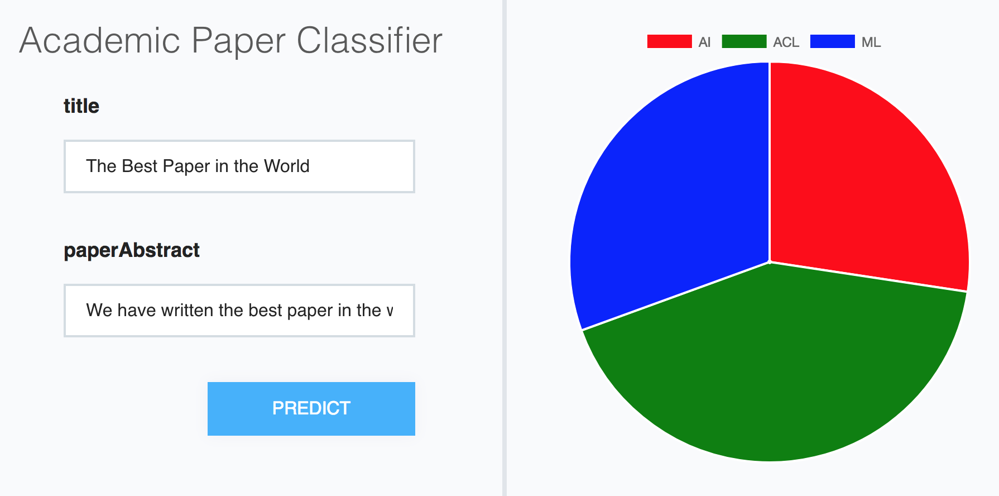

# Making Predictions and Creating a Demo

After you've built and trained a model, it's likely that you want to use it
for something. In this tutorial we'll cover both

* How to make predictions using your model, and
* How to run a web demonstration of your model

Here we'll be working with the paper classification model
we developed in the ["Using AllenNLP in your Project"](using_in_your_repo.md)
tutorial. All the code for that model is [on GitHub](https://github.com/allenai/allennlp-as-a-library-example/tree/0.4.0).
You can either train it yourself or download a
[trained model](https://s3-us-west-2.amazonaws.com/allennlp/models/tutorial-s2-classification-model-2018-02-01.tar.gz),
although in this tutorial we'll just use the tiny model that's included
[as a test fixture](https://github.com/allenai/allennlp-as-a-library-example/tree/0.4.0/tests/fixtures).

## Creating a Predictor

At the core of the paper classification model is our `forward()` function, which looks like

```python
    def forward(self,
                title: Dict[str, torch.LongTensor],
                abstract: Dict[str, torch.LongTensor],
                label: torch.LongTensor = None) -> Dict[str, torch.Tensor]:
```

It takes a Tensor-ized title and abstract (and possibly a label)
and returns some Tensor outputs. That's great for computing loss functions
and performance metrics, but it's less helpful
for making predictions and serving up demos.
For those purposes we'll want to be able to
accept JSON inputs and return JSON results.

AllenNLP provides a [`Predictor`](https://github.com/allenai/allennlp/blob/master/allennlp/service/predictors/predictor.py)
abstraction that wraps a model and does precisely this.
Most of the functionality you need for a `Predictor` is already implemented in the base class.
Usually you only need to implement the `_json_to_instance` function,
which specifies how to turn a JSON dict of inputs into an AllenNLP
[`Instance`](https://allenai.github.io/allennlp-docs/api/allennlp.data.instance.html).
And our `DatasetReader` already has a
[`text_to_instance`](https://github.com/allenai/allennlp-as-a-library-example/blob/0.4.0/my_library/dataset_readers/semantic_scholar_papers.py#L68)
method, which means all we have to do is extract what that method needs from the JSON.

This means our predictor [can be very simple](https://github.com/allenai/allennlp-as-a-library-example/blob/0.4.0/my_library/predictors/paper_classifier_predictor.py):

```python
@Predictor.register('paper-classifier')
class PaperClassifierPredictor(Predictor):
    """Predictor wrapper for the AcademicPaperClassifier"""
    @overrides
    def _json_to_instance(self, json_dict: JsonDict) -> Tuple[Instance, JsonDict]:
        title = json_dict['title']
        abstract = json_dict['paperAbstract']
        instance = self._dataset_reader.text_to_instance(title=title, abstract=abstract)

        # label_dict will be like {0: "ACL", 1: "AI", ...}
        label_dict = self._model.vocab.get_index_to_token_vocabulary('labels')
        # Convert it to list ["ACL", "AI", ...]
        all_labels = [label_dict[i] for i in range(len(label_dict))]

        return instance, {"all_labels": all_labels}
```

To create each `Instance` it just pulls the `"title"` and `"paperAbstract"` fields
out of the input JSON and feeds them to `text_to_instance`.

In this example we also would like to return the list of all possible labels
(this will be useful later when we want to visualize the results).
We first get the mapping from indices to labels, and then we convert
it to a list where position 0 is label 0, and so on.

`_json_to_instance` returns a tuple, where the first element is
the `Instance` and the second element is a `dict` that the elements
of `Model.forward_on_instance` will be added to. Anything that we want
in our JSON output that's not produced by `forward()` goes in it.

Here that's just the list of `all_labels`, so that's what we put in the `dict`.
If we didn't need that, we'd just use an empty `dict` there.

## Testing the Predictor

As always, we want to write a test to give us confidence
that our predictor is doing the right thing.

The main gotcha here is that our test will (implicitly)
need to instantiate our model, dataset reader, and predictor
by name, which means that they need to be registered before
our test runs. I added them all as imports in
[`my_library/__init__.py`](https://github.com/allenai/allennlp-as-a-library-example/blob/0.4.0/my_library/__init__.py),
so we just have to import that package:

```python
import my_library
```

Our test will be pretty simple. We just provide an input in the
desired JSON format (that is, with a `"title"` and an `"abstract"`)
and run it through the model.

If you look at the code for our `forward()`, it produces an output with
a `"label"` and some `"class_probabilities"`. So we'll check that those
exist in our output, that the label has a valid value, and that the
probabilities actually look like probabilities:

```python
class TestPaperClassifierPredictor(TestCase):
    def test_uses_named_inputs(self):
        inputs = {
            "title": "Interferring Discourse Relations in Context",
            "paperAbstract": (
                    "We investigate various contextual effects on text "
                    "interpretation, and account for them by providing "
                    "contextual constraints in a logical theory of text "
                    "interpretation. On the basis of the way these constraints "
                    "interact with the other knowledge sources, we draw some "
                    "general conclusions about the role of domain-specific "
                    "information, top-down and bottom-up discourse information "
                    "flow, and the usefulness of formalisation in discourse theory."
            )
        }

        archive = load_archive('tests/fixtures/model.tar.gz')
        predictor = Predictor.from_archive(archive, 'paper-classifier')

        result = predictor.predict_json(inputs)

        label = result.get("label")
        assert label in ['AI', 'ML', 'ACL']

        class_probabilities = result.get("class_probabilities")
        assert class_probabilities is not None
        assert all(cp > 0 for cp in class_probabilities)
        assert sum(class_probabilities) == approx(1.0)
```

This test passes, so we can feel reasonably good about our predictor.

## Making Predictions

Once we have a predictor, we can make predictions using the command

```bash
python -m allennlp.run predict
```

If you ask it for `--help` you'll see:

```
usage: python -m allennlp.run [command] predict [-h]
                                                [--output-file OUTPUT_FILE]
                                                [--batch-size BATCH_SIZE]
                                                [--silent]
                                                [--cuda-device CUDA_DEVICE]
                                                [-o OVERRIDES]
                                                [--include-package INCLUDE_PACKAGE]
                                                [--predictor PREDICTOR]
                                                archive_file input_file
```

Notice that it requires both an archive file (that is, a trained model)
and an input file (with one JSON input per line).

Here we're using a custom model and predictor, so we'll also need to specify

```
--include-package my_library
```

just as we did during training, and

```
--predictor paper-classifier
```

so that AllenNLP knows which predictor to use.

There are 10 papers in JSONL format at
`tests/fixtures/s2_papers.jsonl`, so let's make some predictions on those:

```bash
python -m allennlp.run predict \
    tests/fixtures/model.tar.gz \
    tests/fixtures/s2_papers.jsonl \
    --include-package my_library \
    --predictor paper-classifier
```

When you run this it will print the ten test inputs and their predictions, each of which looks like:

```
prediction:  {"all_labels": ["AI", "ACL", "ML"], "logits": [0.008737504482269287, 0.22074833512306213, -0.005263201892375946], "class_probabilities": [0.31034138798713684, 0.38363200426101685, 0.3060266375541687], "label": "ACL"}
```

If you want your predictions to go to a file instead,
you just need to specify an `--output-file`.

## Running a Web Demo

Once you have a trained model and a predictor,
it's easy to run a simple web demo:

```
$ python -m allennlp.service.server_simple --help

usage: server_simple.py [-h] [--archive-path ARCHIVE_PATH]
                        [--predictor PREDICTOR] [--static-dir STATIC_DIR]
                        [--title TITLE] [--field-name FIELD_NAME]
                        [--include-package INCLUDE_PACKAGE]
```

Let's ignore the `--static-dir` flag for now and serve up the test fixture model:

```
python -m allennlp.service.server_simple \
    --archive-path tests/fixtures/model.tar.gz \
    --predictor paper-classifier \
    --include-package my_library \
    --title "Academic Paper Classifier" \
    --field-name title \
    --field-name paperAbstract
```

This will start a server at `localhost:8888` that serves up a really simple
text-in-json-out version of your model:



Most of the options should be familiar to you by now.
The two new ones are `--title`, which just specifies the title
for the web demo, and `--field-name`, which specifies the input
fields to create. The field names *must* exactly match the JSON keys
that the predictor is expecting, or the demo won't work!

## Customizing the Demo

Our JSON "visualization" is not particularly impressive.
We can customize it by putting our own `index.html`
(and any other files we need) in some directory
and calling `server_simple` with the `--static-dir` flag.
In this case we don't need to provide a title or field names,
as those will be implicitly provided by the HTML code.

The simplest way to get started is to just "view source" on the demo
and save the resulting file in some directory. I called my directory
[`static_html`](https://github.com/allenai/allennlp-as-a-library-example/tree/0.4.0/static_html)
and saved `index.html` there. The original page had a lot of embedded CSS, which I split out into
[its own file](https://github.com/allenai/allennlp-as-a-library-example/blob/0.4.0/static_html/demo.css).

For our customization, we'll replace the ugly JSON output
with a beautiful pie chart of the predicted class probabilities,
using a library called
[chart.js](http://www.chartjs.org/docs/latest/getting-started/usage.html).

To start with, we need to [add a `script` tag to load chart.js](https://github.com/allenai/allennlp-as-a-library-example/blob/0.4.0/static_html/index.html#L47).

```html
<script src="https://cdnjs.cloudflare.com/ajax/libs/Chart.js/2.3.0/Chart.bundle.js"></script>
```

If you look at the original HTML, the output starts off
[with a placeholder](https://github.com/allenai/allennlp/blob/master/allennlp/service/server_simple.py#L186):

```html
<div id="output" class="output">
    <div class="placeholder">
        <div class="placeholder__content">
            <p>Run model to view results</p>
        </div>
    </div>
</div>
```

And the JavaScript code just
[has a callback](https://github.com/allenai/allennlp/blob/master/allennlp/service/server_simple.py#L214)
that runs when it gets a prediction back from the server:

```javascript
document.getElementById("output").innerHTML = htmlResults;
```

Which means we just need to make a few changes to those parts of our code.
If you look at the `chart.js` documentation, we'll need to have a `canvas` element
for our chart, so we'll start by
[placing that inside our `output` div](https://github.com/allenai/allennlp-as-a-library-example/blob/0.4.0/static_html/index.html#L61):

```javascript
var canvas = '<canvas id="myChart" width="400" height="400"></canvas>';
document.getElementById("output").innerHTML = canvas;
```

We also want to parse the prediction response into JSON:

```javascript
var response = JSON.parse(xhr.responseText);
```

And finally we just need to follow their docs for creating a pie chart:

```javascript
var ctx = document.getElementById("myChart");
var pieChart = new Chart(ctx, {
    type: 'pie',
    data: {
        labels: response['all_labels'],
        datasets: [{
            data: response['class_probabilities'],
            backgroundColor: ['red', 'green', 'blue']
        }]
    }
});
```

Now we can run our custom demo:

```bash
python -m allennlp.service.server_simple \
    --archive-path tests/fixtures/model.tar.gz \
    --predictor paper-classifier \
    --include-package my_library \
    --static-dir static_html
```


And we get a brilliant pie chart with mouseovers and everything:



This was a very simple example.
If you like writing HTML and CSS and JavaScript,
the sky is the limit for what you can customize.

And while you can certainly use this to impress your boss,
it can also be valuable for debugging misbehaving models.
Just modify your `Model.forward()` to output whatever
model internals you're curious about, and then use
a custom demo to visualize those internals on
a variety of different inputs.

Happy demo-ing!
