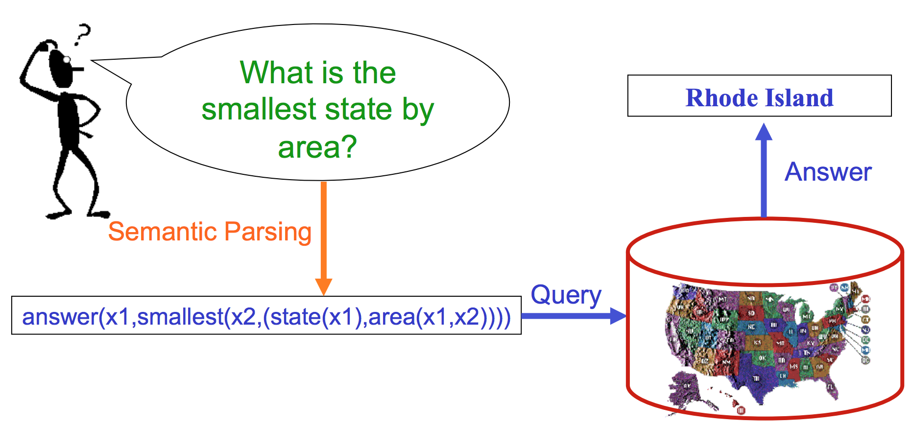

# The AllenNLP Semantic Parsing Framework

_Semantic parsing_ is the task of mapping language to some kind of formal meaning representation.
This meaning representation could be a [logical
statement](https://www.semanticscholar.org/paper/Online-Learning-of-Relaxed-CCG-Grammars-for-Parsing-Zettlemoyer-Collins/674ec285ce3a2d0a28d5dbf555f9885764bb6b45)
in [lambda
calculus](https://www.semanticscholar.org/paper/Learning-Executable-Semantic-Parsers-for-Natural-Liang/6ff9c6e43be86d7608a391b83de4cd44d707ea8d),
a [set of
instructions](https://www.semanticscholar.org/paper/Weakly-Supervised-Learning-of-Semantic-Parsers-for-Artzi-Zettlemoyer/14ea9a076ee744959d4ab2188a06d0ce64d362bf)
for a [robot to
follow](https://www.semanticscholar.org/paper/Simpler-Context-Dependent-Logical-Forms-via-Model-Long-Pasupat/7306437b2145677fe7bf3b7711ac8aa25989f1e3),
or even a
[Python](https://www.semanticscholar.org/paper/Learning-to-Generate-Pseudo-Code-from-Source-Code-Oda-Fudaba/27e1dbe9f7c71cd6cc1b0357f49aef497e572d09),
[Java](https://www.semanticscholar.org/paper/Mapping-Language-to-Code-in-Programmatic-Context-Iyer-Konstas/503440e95aea0e410a1f05682315748467b0dc78),
or [SQL
program](https://www.semanticscholar.org/paper/Learning-a-Neural-Semantic-Parser-from-User-Iyer-Konstas/32ce5467ff884d2f90a233f4d9606c6e18b1a9d6).
In some cases these meaning representations are directly executable in some environment (like
executing a query against a database, or running python code), and in others they are simply an
attempt to normalize the semantics of a natural language utterance (like [Abstract Meaning
Representations](https://www.semanticscholar.org/paper/Abstract-Meaning-Representation-for-Sembanking-Banarescu-Bonial/d5b1adc8277e601139b777c250d3cdb41ffc29c8)
or [open-domain CCG
semantics](https://www.semanticscholar.org/paper/A*-CCG-Parsing-with-a-Supertag-factored-Model-Lewis-Steedman/0551fa57a42ae0fff9c670dffecfc0c63e0ec89d)).
The thing all of these variations have in common is that they try to capture the meaning of
language in some form, and there typically isn't a direct mapping from words in the utterance to
the pieces of the meaning representation.  Our focus is on cases where the meaning representation
is directly executable, and we'll talk about defining languages and execution engines for this, but
you could conceivably use pieces of this framework for other kinds of semantic parsing if you want.


<sub>Image credit: Ray Mooney</sub>

We approach this problem in AllenNLP with encoder-decoder models, similar to the seq2seq models
used in neural machine translation or summarization.  That is, we encode the input utterance (and
whatever other context is available) using some neural encoder, then use a decoder to produce a
statement in the output language. Because the output language in semantic parsing is a formal
language, however, we use _constrained decoding_, forcing the model to only produce valid meaning
representations.  That is, if we're producing code in a lisp-like language, we know we can't start
with ")" - that wouldn't be a valid program.

We accomplish this with a generic state machine decoder, where the model defines a transition
system stipulating which actions are valid at any particular state.  If the "actions" are all of
the tokens in some output vocabulary, and all actions are valid at every state, this would be a
standard seq2seq model.<sup>[1](#footnote1)</sup> By changing what the actions represent, or
constraining the valid actions at each timestep of decoding, however, we can learn better models
that are tailored for our task.  For semantic parsing, the "actions" will incrementally build up a
statement in some formal language, with constraints on the allowed actions at each step to ensure
that only valid statements are generated.  Note, however, that state machines are more general than
semantic parsers, and you can use this framework for any structured prediction problem that you can
formulate as a transition system.

The rest of this tutorial will walk you through the pieces of the semantic parsing framework:

- [Transition functions and training algorithms](#section1)
- [Keeping track of the decoder's state](#section2)
- [Defining a transition system (or a logical form language) to specify what actions there are and
  when they can be taken, and an execution engine for that language](#section3)
- [Adding context to your model (like a table or a database)](#section4)
- [Putting the context, the transition system, and the execution engine together into a
  `World`](#section5)
- [Summary of what's available](#section6)

<sub><a name="footnote1">1</a>: There are much more efficient ways to implement standard seq2seq models
than using a transition system.  If that's what you want to do, maybe look at our [SimpleSeq2Seq
model](../../allennlp/models/encoder_decoders/simple_seq2seq.py).</sub>


<a name="section1"></a>
## Training a transition function

The fundamental piece of the semantic parsing framework is the
[`TransitionFunction`](../../allennlp/state_machines/transition_functions/transition_function.py).
This is a pytorch `Module` that parameterizes state transitions.  That is, given a
[`State`](#section2), the `TransitionFunction` returns a scored and ranked list of next `States`:

```python
class TransitionFunction(torch.nn.Module, Generic[StateType]):
    def take_step(self,
                  state: StateType,
                  max_actions: int = None,
                  allowed_actions: List[Set] = None) -> List[StateType]:
        raise NotImplementedError
```

If you ignore the optional arguments for a minute, this is a simple function that takes a `State`
of a particular type and returns a list of `States` of the same type.  This function will have some
parameters, probably based on some kind of LSTM decoder hidden state, that are used to score each
valid action, construct new `States` for those actions, and return them.  The optional parameters
are for efficiency, so you don't construct huge numbers of `State` objects if you know you're doing
a beam search with size `k`, or if you're training and only need to score a few select action
sequences.

The `TransitionFunction` (along with a `State` object which we'll [get to later](#section2)) forms
the basis of our decoder state machine, and now we need some way to train it.  There are many ways
to train state machines, depending on what kind of supervision you have.  You could have
fully-labeled correct action sequences (e.g., [questions paired with SQL
queries](https://www.semanticscholar.org/paper/Seq2SQL%3A-Generating-Structured-Queries-from-Natural-Zhong-Xiong/116a877c774969b53399b1ccaa34d51bfb492ee4)),
a set of possibly correct action sequences ([questions paired a set of logical forms that evaluate
to the correct
answer](https://www.semanticscholar.org/paper/Neural-Semantic-Parsing-with-Type-Constraints-for-Krishnamurthy-Dasigi/8c6f58ed0ebf379858c0bbe02c53ee51b3eb398a)),
a way to check the correctness of finished states ([questions paired with
answers](https://www.semanticscholar.org/paper/Semantic-Parsing-on-Freebase-from-Question-Answer-Berant-Chou/042db0977555fcd7d5eac67b26695cd918ecb44c)),
or just a reward function on finished or intermediate states ([general reinforcement
learning](https://www.semanticscholar.org/paper/Maximum-Margin-Reward-Networks-for-Learning-from-Peng-Chang/b53404e5410b5098e246f405c8509fbf3de8ab2a)).
To handle the variety of supervision signals that could be used, we provide a simple
[`DecoderTrainer`](../../allennlp/state_machines/trainers/decoder_trainer.py) interface that's
generic over the supervision type:

```python
class DecoderTrainer(Generic[SupervisionType]):
    def decode(self,
               initial_state: State,
               transition_function: TransitionFunction,
               supervision: SupervisionType) -> Dict[str, torch.Tensor]:
        raise NotImplementedError
```

The `SupervisionType` here could be a correct action sequence or a reward function (or anything
else you choose); the generic interface makes it so that you can easily swap out trainers that take
the same supervision signal (such as maximum likelihood with beam search optimization, or various
reinforcement learning algorithms with each other).  The `DecoderTrainer` requires an initial
`State`, a `TransitionFunction`, and a supervision signal, and it returns a `loss` tensor that we
use to compute gradients and train the `TransitionFunction` and the encoder that created the
initial `State` (the return value is a dictionary so you can return whatever else you want, too).

There are several examples of `DecoderTrainers` and `TransitionFunctions` already in the library,
and you can create your own if what we have doesn't fit your needs (and if you implement your own
that you think would be useful for others, please consider contributing it back!).  Here are a few
examples (not an exhaustive list):

`DecoderTrainers`:
- [`MaximumMarginalLikelihood`](../../allennlp/state_machines/trainers/maximum_marginal_likelihood.py)
  (when you have a set of possibly correct action sequences, e.g., after you've done a search for
action sequences that match the correct answer to a question)
- [`ExpectedRiskMinimization`](../../allennlp/state_machines/trainers/expected_risk_minimization.py)
  (when you have a reward function, e.g., for finished states that tells you whether the logical
form executed correctly)

`TransitionFunctions`:
- [`BasicTransitionFunction`](../../allennlp/state_machines/transition_functions/basic_transition_function.py):
  a simple LSTM decoder with attention that uses a grammar to constrain the actions available at
each state.
- [`LinkingTransitionFunction`](../../allennlp/state_machines/transition_functions/linking_transition_function.py):
  an extension of the `BasicTransitionFunction` that allows some actions to be parameterized by
linking to words in the utterance, instead of having an embedding for each action.  This allows for
predicting actions at test time that were never seen at training time, to do various kinds of
zero-shot prediction.

We'll note here that separating the pieces out this way makes it relatively easy to try out
different training algorithms.  Our models for
[`WikiTableQuestions`](../../allennlp/models/semantic_parsing/wikitables/) and
[`NLVR`](../../allennlp/models/semantic_parsing/nlvr) both have versions using
`MaximumMarginalLikelihood` and `ExpectedRiskMinimization`, and for many semantic parsers, either
the `BasicTransitionFunction` or the `LinkingTransitionFunction` should be all you need for a
standard decoder, and all you have to implement in your model is the encoder.


<a name="section2"></a>
## Tracking the State of the decoder

Our
[`TransitionFunctions`](../../allennlp/state_machines/transition_functions/transition_function.py)
operate on [`States`](../../allennlp/state_machines/states/state.py), scoring actions available at
each `State` and returning ranked lists of new ones.  In order for this to work, we need some way
of representing that `State`, including any intermediate computations that are necessary for
scoring actions.  We do this with a simple `State` object:

```python
class State:
    def __init__(self,
                 batch_indices: List[int],
                 action_history: List[List[int]],
                 score: List[torch.Tensor]) -> None:
        ...

    def is_finished(self) -> bool:
        raise NotImplementedError

    @classmethod
    def combine_states(cls, states: List[State]) -> State:
        raise NotImplementedError
```

The first thing to notice here is that we're dealing with lists - in order to speed things up a
bit, we batch some of our computation together.  A semantic parsing `Model` will typically encode
its (batched) inputs and construct a (batched) `State`, where each instance in the batch gets an
entry in the initial `State`, with an empty action history and a score of 0.  During decoding, if
you are doing any kind of search, we can further group together computation from multiple `States`
on the beam for the same batch instance, which lets us, for example, only run the decoder LSTM cell
on the GPU once per timestep.  We do this with the `combine_states` method, which might result in a
`State` that has multiple entries per batch index.

But what goes into a `State`?  The generic base class just has the minimal interface necessary for
the `DecoderTrainer` to interact with it: a score, what actions have been taken, a way to tell if
we should stop, and a way to combine states together for better batching.  Your
`TransitionFunction` will certainly need more information, like the actual hidden state of a
decoder LSTM, or the actions that are available in the current state.  To group together some
common pieces of this internal state, we have a few `Statelet` classes available.  We'll go over
two of them: `RnnStatelet` and `GrammarStatelet`.

[`RnnStatelet`](../../allennlp/state_machines/states/rnn_statelet.py) keeps track of the internal
state of a decoder RNN:

```python
class RnnStatelet:
    def __init__(self,
                 hidden_state: torch.Tensor,
                 memory_cell: torch.Tensor,
                 previous_action_embedding: torch.Tensor,
                 attended_input: torch.Tensor,
                 encoder_outputs: List[torch.Tensor],
                 encoder_output_mask: List[torch.Tensor]) -> None:
        ...
```

This includes the typical hidden state and memory cell for an LSTM, but also the embedding for the
action taken at the previous timestep (which will be used as input to the next timestep), and the
previous attended input (which is also used as part of the input to the next timestep, for
"attention feeding").  And because we compute attention over the encoded input representations in
the LSTM decoder, we also include those inputs (and their mask) as part of the `RnnStatelet`.

[`GrammarStatelet`](../../allennlp/state_machines/states/grammar_statelet.py) keeps track of the
current state of the grammar during decoding: what non-terminal is at the top of the non-terminal
stack, what actions are available, and so on:

```python
class GrammarStatelet:
    def __init__(self,
                 nonterminal_stack: List[str],
                 valid_actions: Dict[str, ActionRepresentation],
                 is_nonterminal: Callable[[str], bool]) -> None:
        ...

    def is_finished(self) -> bool:
        ...

    def get_valid_actions(self) -> ActionRepresentation:
        ...

    def take_action(self, production_rule: str) -> 'GrammarStatelet':
        ...
```

The `valid_actions` dictionary here would have a mapping from non-terminals (e.g., `START`) to
representations of allowed productions of that non-terminal (e.g., `int`, `bool`, `str`).  These
representations could just be an id for that production, or, for efficiency, you may have
pre-embedded all of your actions and just use those here.  It's up to you.

To group these things together, we have a
[`GrammarBasedState`](../../allennlp/state_machines/states/grammar_based_state.py) class, that you
can actually use with a `TransitionFunction`:

```python
class GrammarBasedState():
    def __init__(self,
                 batch_indices: List[int],
                 action_history: List[List[int]],
                 score: List[torch.Tensor],
                 rnn_state: List[RnnStatelet],
                 grammar_state: List[GrammarStatelet],
                 possible_actions: List[List[ProductionRule]],
                 extras: List[Any] = None,
                 debug_info: List = None) -> None:
```

As you can see, this keeps track of the basic things that any `State` needs (lists of batch
indices, action histories, and scores), along with the `RnnStatelets` and `GrammarStatelets`
discussed above, and a few other fields that are helpful during decoding.


<a name="section3"></a>
## Defining a language and an execution engine

The previous two sections of this tutorial dealt with a general architecture for training state
machines, which can be used for any transition system, not just a semantic parser.  For the rest of
this tutorial, we'll focus on using those state machines to do semantic parsing, by defining a
language to parse into, an execution engine for that language, and actually executing logical forms
or programs in a specific context.

And, I'll warn you ahead of time, the way we currently define languages is a bit convoluted and
difficult to work with.  Sorry.  We're working on a better way to do this, but this is what we have
for now.  The main issue is that all of our models currently do [_grammar-based
decoding_](https://github.com/allenai/acl2018-semantic-parsing-tutorial/blob/master/slides/constrained_decoding.pdf).
That is, instead of outputting tokens in the target language directly, we build an abstract syntax
tree of the target program, linearize that tree, and produce it sequentially.  You can see an
example of this in our [WikiTableQuestions parser
demo](https://demo.allennlp.org/wikitables-parser), if you look at the predicted actions.  Each
action expands a non-terminal in the tree.  Constructing this grammar over abstract syntax trees is
a bit messy.

There are currently two ways to do this with our framework: you can use an `nltk`-based logic
system, seen in [`semparse.type_declarations`](../../allennlp/semparse/type_declarations), or you
can use [`parsimonious` to write a context-free
grammar](../../allennlp/semparse/contexts/atis_sql_table_context.py).  With the `nltk`-based
system, you define the functions that are available in your (lisp-like) language, with their type
signatures, and our code builds a grammar for you that can parse statements in that language.  With
the `parsimonious` system, you have to come up with the grammar yourself, but you have more
flexibility in the language that is parsed (we use this for SQL, which is not lisp-like).

The key functionality of both of these systems is to (1) go from a logical form or program to a
sequence of actions that the parser can output, (2) define the allowed actions at each timestep
(which is determined by the current grammar state), and (3) go from a sequence of actions back to a
logical form.  If you have your own method of getting this functionality that doesn't need either
of our two options (for example, by using a compiler's abstract syntax tree), then you can bypass
these pieces of the framework entirely - just pass the action sequences and the set of valid
actions into your model however you want.

Instead of describing in detail how these two systems work, we'll just point you to some examples
and their documentation.

For the `nltk`-based system:
- [Base logic and documentation](../../allennlp/semparse/type_declarations/type_declaration.py)
- [WikiTableQuestions lambda-DCS grammar](../../allennlp/semparse/type_declarations/wikitables_lambda_dcs.py)
- [WikiTableQuestions variable-free grammar](../../allennlp/semparse/type_declarations/wikitables_variable_free.py)
- [NLVR grammar](../../allennlp/semparse/type_declarations/nlvr_type_declaration.py)

For the `parsimonious` system:
- [ATIS SQL grammar](../../allennlp/semparse/contexts/atis_sql_table_context.py)
- [A separate SQL grammar for a different set of SQL
  datasets](../../allennlp/semparse/contexts/text2sql_table_context.py)

If you are trying to implement your own language using these and have trouble, open an issue on
github and we'll see what we can do.

For executing logical forms, we have put our execution engines in
[`semparse.executors`](../../allennlp/semparse/executors); you can see what is available there.
There isn't any consistent theme for defining the execution engine - some of the executors call
subprocesses to execute the logical form (for SQL and for using
[SEMPRE](https://github.com/percyliang/sempre) to evaluate lambda-DCS), and some of them have
executors that are just python code.

We have some ideas around how to combine the language definition and the executor into one simple
piece of python code, but we're still working on that.  Hopefully this piece will be easier in the
not-too-distant future.


<a name="section4"></a>
## Adding context to a model

Many semantic parsing tasks have some additional piece of context as input, like a [knowledge
graph](https://www.semanticscholar.org/paper/Weakly-Supervised-Training-of-Semantic-Parsers-Krishnamurthy-Mitchell/00ff3c9d8bbcc09448b768aa80666eb775445c00),
[a
table](https://www.semanticscholar.org/paper/Compositional-Semantic-Parsing-on-Semi-Structured-Pasupat-Liang/41ab97376fcbd67d05bad648b40d92d96a3f1c1c),
or a [SQL
database](https://www.semanticscholar.org/paper/Learning-to-Map-Context-Dependent-Sentences-to-Suhr-Iyer/3171f531bdd917ebe9a9849339ee67f0e9ce887b).
We have code for representing some of these additional contexts in
[`semparse.contexts`](../../allennlp/semparse/contexts).  For example, the
[`TableQuestionKnowledgeGraph`](../../allennlp/semparse/contexts/table_question_knowledge_graph.py)
takes a table and a question from the WikiTableQuestions dataset and extracts a set of "entities"
and relationships between them.  The
[`AtisSqlTableContext`](../../allennlp/semparse/contexts/atis_sql_table_context.py) takes a SQL
database and reads its tables and columns to constrain the SQL grammar that gets generated, so you
can only produce queries that reference columns that are actually in the table.


<a name="section5"></a>
## Combining the context, language and execution together into a World

We put all of these pieces together for any particular
[`Instance`](../../allennlp/data/instance.py) in a
[`World`](../../allennlp/semparse/worlds/world.py) class.  This class knows what language is being
used, what `Instance`-specific context there is, and how to execute logical forms, so it is the
main way that a `Model` can interact with the language.

The `World` has, potentially, six functions:

1. Has a list of all possible actions for a given `Instance`, so we can convert them to integers.
2. Defines which actions are valid in any given state.
3. Maps logical forms to action sequences.
4. Converts action sequences back to logical forms.
5. Executes logical forms in some (potentially `Instance`-specific) context.
6. Passes along `Instance`-specific context to the `Model`.

Most of this work is actually done by the inputs to the `World` (the context, the grammar, and the
executor), but sometimes there are interactions between the three that require an object to mediate
those interactions.  For example, the execution engine for NLVR requires a particular structured
object to execute logical forms on, and the table in a WikiTableQuestions instance can add things
to the grammar.

As with defining the language, if you have your own way of performing those six functions, you can
bypass our `World` code and still use whatever other components you find helpful.  If you are using
our `nltk`-based logic system to define your language, however, the base
[`World`](../../allennlp/semparse/worlds/world.py) class has some important functionality for
getting the type system to work correctly (e.g., the logic that converts logical forms to action
sequences and back actually lives partially in `World`).  This could probably use a bit of
refactoring.


<a name="section6"></a>
## Putting it all together: a quick summary

There are a bunch of moving pieces to get a semantic parser working.  To summarize, we have:

1. A general state machine architecture for training transition functions (in
   [`allennlp.state_machines`](../../allennlp/state_machines)).  Your model creates an initial
[`State`](../../allennlp/state_machines/states/state.py) and a
[`TransitionFunction`](../../allennlp/state_machines/transition_functions/transition_function.py),
and passes these off to a
[`DecoderTrainer`](../../allennlp/state_machines/trainers/decoder_trainer.py) that implements some
learning algorithm.
2. A bunch of examples of using this architecture for training semantic parsers (in
   [`allennlp.semparse`](../../allennlp/semparse) and
[`allennlp.models.semantic_parsing`](../../allennlp/models/semantic_parsing)).  The language you're
parsing into determines the state space and the transition system (which you can specify using our
[`nltk`-based logic system](../../allennlp/semparse/type_declarations), or using `parsimonious` or
something similar).  The [`Model`](../../allennlp/models/semantic_parsing) encodes some input
utterance (and possibly some additional context), instantiates a
[`World`](../../allennlp/semparse/worlds/world.py) that can execute logical forms in some (possibly
`Instance`-specific) context, initializes the grammar and RNN states, and passes all of this off to
the state machine architecture.

These are the datasets that are currently supported:

- [WikiTableQuestions](../../allennlp/data/dataset_readers/semantic_parsing/wikitables.py), a
  dataset of questions over tables extracted from Wikipedia
([paper](https://www.semanticscholar.org/paper/Compositional-Semantic-Parsing-on-Semi-Structured-Pasupat-Liang/41ab97376fcbd67d05bad648b40d92d96a3f1c1c),
[website](https://nlp.stanford.edu/blog/wikitablequestions-a-complex-real-world-question-understanding-dataset/)).
We support the lambda-DCS language by interfacing with
[SEMPRE](https://github.com/percyliang/sempre), and very soon we will also support the
variable-free language in [Chen Liang's MAPO
paper](https://www.semanticscholar.org/paper/Memory-Augmented-Policy-Optimization-for-Program-Liang-Norouzi/16a32fb65e75963e763151636587c16f6ab7b5cf).
- [Cornell Natural Language Visual Reasoning
  (NLVR)](../../allennlp/data/dataset_readers/semantic_parsing/nlvr.py), a dataset of true/false
statements about images
([paper](https://www.semanticscholar.org/paper/A-Corpus-of-Natural-Language-for-Visual-Reasoning-Suhr-Lewis/c208f738fba3e3598018e6fdfbc72c6fbb7ba9d0),
[website](http://lic.nlp.cornell.edu/nlvr/)).  We designed a simple language that operates on the
structured representations in the dataset (not the images), and this is what we use.
- [ATIS](../../allennlp/data/dataset_readers/semantic_parsing/atis.py), a dataset of interactions
  with a flight service, mapping language to SQL queries.  We support hierarchical, grammar-based
decoding of SQL on this dataset, using a hand-built `parsimonious` grammar for the SQL queries.
- All of the text-to-SQL datasets from the "Improving Text-to-SQL Evaluation Methodology" paper
  ([paper](https://www.semanticscholar.org/paper/Improving-Text-to-SQL-Evaluation-Methodology-Finegan-Dollak-Kummerfeld/23474a845ea4b67f38bde7c7f1c4c1bdba22c50c),
[website](https://github.com/jkkummerfeld/text2sql-data)).  You can use this data either with
[template prediction and slot
filling](../../allennlp/data/dataset_readers/semantic_parsing/template_text2sql.py), or with
[grammar-based
decoding](../../allennlp/data/dataset_readers/semantic_parsing/grammar_based_text2sql.py), using a
general SQL grammar that we wrote with `parsimonious`.
- [QuaRel](../../allennlp/data/dataset_readers/semantic_parsing/quarel.py), a dataset of science
  questions that require qualitative reasoning (paper and website coming soon).

There are models implemented for most of these datasets, many of which you can see in our
[demo](https://demo.allennlp.org).

Is there a dataset or model that you really want to work on that's not here?  We'd love to hear
about it, or to have contributions to add more capability to this framework.  Just open an issue or
a pull request on github.  If you want to use a relatively standard model on some new dataset, the
main piece you'll have to worry about is the transition system, making a way to go from the logical
forms in your training data to action sequences that we can use to train.  Once you have that, you
should be able to copy one of our examples and swap out the pieces that are specific to your data.
