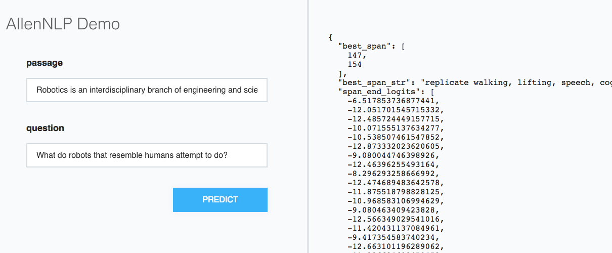

# So You Built a Model, Now What?

After you've built and trained a model, it's likely that you want to use it
for something. In this tutorial we'll cover both

* How to make predictions using your model, and
* How to run a web demonstration of your model

Here we'll be working with the [Bidaf](https://github.com/allenai/allennlp/blob/master/allennlp/models/reading_comprehension/bidaf.py)
model for machine comprehension. You can either train your own
or download a [trained model](https://s3-us-west-2.amazonaws.com/allennlp/models/bidaf-model-2017.09.15-charpad.tar.gz).

Although we're using a model and predictor that are included in AllenNLP,
we're going to approach this tutorial as if they weren't,
so that you can see what to do with your own.

## Creating a Predictor

At the core of an AllenNLP model is a function that looks like

```python
    def forward(self,  # type: ignore
                question: Dict[str, torch.LongTensor],
                passage: Dict[str, torch.LongTensor],
                span_start: torch.IntTensor = None,
                span_end: torch.IntTensor = None,
                metadata: List[Dict[str, Any]] = None) -> Dict[str, torch.Tensor]:
```

It takes a bunch of Tensor-ized inputs and returns a bunch of Tensor outputs.
That's usually less than helpful for making predictions and serving up demos.
Instead, we'll want to take in JSON inputs and return JSON results.

AllenNLP provides a [`Predictor`](https://github.com/allenai/allennlp/blob/master/allennlp/service/predictors/predictor.py)
abstraction to do precisely this.
Most of the needed functionality is already implemented in the base class.
In most cases you'll only need to implement the `_json_to_instance` function,
which specifies how to turn a JSON dict of inputs into an
[`Instance`](https://allenai.github.io/allennlp-docs/api/allennlp.data.instance.html).
Your `DatasetReader` should already have a
[`text_to_instance`](https://allenai.github.io/allennlp-docs/api/allennlp.data.dataset_readers.dataset_reader.html#allennlp.data.dataset_readers.dataset_reader.DatasetReader.text_to_instance)
method, and so all you have to do is extract what it needs from the JSON.

Accordingly, the existing Bidaf predictor is very simple:

```python
@Predictor.register('machine-comprehension')
class BidafPredictor(Predictor):
    """
    Wrapper for the :class:`~allennlp.models.bidaf.BidirectionalAttentionFlow` model.
    """
    @overrides
    def _json_to_instance(self, json_dict: JsonDict) -> Tuple[Instance, JsonDict]:
        """
        Expects JSON that looks like ``{"question": "...", "passage": "..."}``.
        """
        question_text = json_dict["question"]
        passage_text = json_dict["passage"]
        return self._dataset_reader.text_to_instance(question_text, passage_text), {}
```

As you can see, it just pulls the `"question"` and `"passage"` fields out of the input JSON
and feeds them to `text_to_instance`. (The second return parameter is an output dict
that the results of `Model.forward_on_instance` will get added to.  Here we use an empty dict,
but if you wanted (for example) the `question_text` included in the output, you could make
that happen here.)

## Making Predictions

As in the
[Using AllenNLP in Your Project](https://github.com/allenai/allennlp/blob/master/tutorials/getting_started/using_in_your_repo.md#step-five-train-the-model) tutorial,
we'll need to create a custom `run.py` script that imports our custom registered classes
(that is, our `DatasetReader`, our `Model`, our `Predictor`, and anything else they rely on)
and then [calls `main()`](https://github.com/allenai/allennlp/blob/master/allennlp/commands/__init__.py#L28).

Here we have one additional step: we need to associate our custom predictor with our model.
This is accomplished via the

```python
         predictor_overrides: Dict[str, str] = {},
```

parameter, which is a mapping from `Model` name to `Predictor` name.

In our case we'd have to call

```python
    main(prog="python run.py",
         predictor_overrides={'bidaf': 'machine-comprehension'})
```

to specify that when we see a `bidaf` model and need a `Predictor`
we should use the `machine-comprehension` one.
(As mentioned before, these are already associated
[by default](https://github.com/allenai/allennlp/blob/master/allennlp/commands/predict.py#L35),
but for tutorial reasons we're pretending they're not.)

At this point you just need an input file in JSON lines format:

```
{"question": "First question...", "passage": "First passage..."}
{"question": "Second question...", "passage": "Second passage..."}
...
```

If you run your script, you should get a help message:

```bash
$ run.py predict
usage: python -m allennlp.run predict [-h]
                                      [--output-file OUTPUT_FILE]
                                      [--batch-size BATCH_SIZE]
                                      [--silent]
                                      [--cuda-device CUDA_DEVICE]
                                      [-o OVERRIDES]
                                      archive_file input_file
```

In the simplest case, just specify the `archive_file`
(that's the trained model we downloaded above)
and the `input_file`
(that's the JSON lines file above)
and your predictions will get printed to the console.
If you'd rather have them in a file, specify the `--output-file` parameter.

It's also possible to use non-JSON formats, for example, if you had CSV data.
In this case your `Predictor` would need to override `load_line` and `dump_line`.

## Running a Web Demo

Once you have a trained model and a predictor,
it's easy to run a simple web demo
using `allennlp.service.server_simple.make_app()`:

```python
from allennlp.models.archival import load_archive
from allennlp.service.predictors import Predictor
from allennlp.service.server_simple import make_app

from gevent.wsgi import WSGIServer

archive = load_archive('/path/to/trained/bidaf/model.tar.gz')
predictor = Predictor.from_archive(archive, 'machine-comprehension')

app = make_app(predictor=predictor,
               field_names=['passage', 'question'])

http_server = WSGIServer(('0.0.0.0', 8888), app)
http_server.serve_forever()
```

The important things to notice are

* We had to explicitly specify which predictor to use. If you were
  using a custom one, you'd need to import it at the top of the script.
* We had to explicitly specify the field names. These are used to generate
  the web interface but also (more importantly) as the keys in the input JSON,
  which means they need to match what your `Predictor` expects
* We specified port 8888, but you could have specified any other port.

If you run this script and visit `localhost:8888` in your browser,
you'll see a moderately attractive demo that displays the raw JSON
results:



It's possible this won't quite suit your needs, in which case
`make_app` [provides a few more options](https://github.com/allenai/allennlp/blob/master/allennlp/service/server_simple.py#L25)

For example, you might want to change the page title to something other than "AllenNLP Demo".
If, so, pass in a `title="Something else"` parameter.

Or you might want to edit the returned JSON. Maybe you want to remove some of its verbose
fields, or maybe you want to add a new nicely formatted field. In that case you can pass
a `sanitizer=sanitizer` parameter, with a JSON-in-JSON-out function that contains the editing
logic.

If you're really motivated, you might want to just provide your own HTML page.
(If so, I suggest using ours as a starting point, as it already contains the JavaScript
 for making AJAX calls to get predictions.) In that case put all your files
in some directory (with the entry page called `index.html`)
and pass it in as `static_dir=your_dir`.
