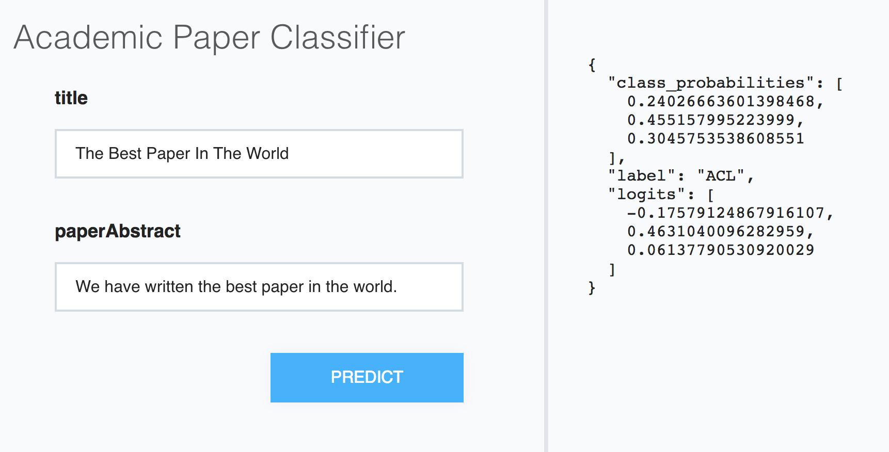

# So You Built a Model, Now What?

After you've built and trained a model, it's likely that you want to use it
for something. In this tutorial we'll cover both

* How to make predictions using your model, and
* How to run a web demonstration of your model

Here we'll be working the S2 classification model
we developed in the [Using AllenNLP in your Project](using_in_your_repo.md)
tutorial. The code for that model is [on GitHub](https://github.com/allenai/allennlp-as-a-library-example).
You can either train it yourself or download a
[trained model](https://s3-us-west-2.amazonaws.com/allennlp/models/tutorial-s2-classification-model-2018-02-01.tar.gz).

## Creating a Predictor

At the core of our classification model is our `forward()` function:

```python
    def forward(self,
                title: Dict[str, torch.LongTensor],
                abstract: Dict[str, torch.LongTensor],
                label: torch.LongTensor = None) -> Dict[str, torch.Tensor]:
```

It takes a Tensor-ized title and abstract (and possibly a label)
and returns some Tensor outputs.
That's usually less than helpful
for making predictions and serving up demos.
Instead, we'll want to take in JSON inputs and return JSON results.

AllenNLP provides a [`Predictor`](https://github.com/allenai/allennlp/blob/master/allennlp/service/predictors/predictor.py)
abstraction to do precisely this.
Most of the needed functionality is already implemented in the base class.
In most cases you'll only need to implement the `_json_to_instance` function,
which specifies how to turn a JSON dict of inputs into an
[`Instance`](https://allenai.github.io/allennlp-docs/api/allennlp.data.instance.html).
Our `DatasetReader` already has a
[`text_to_instance`](https://github.com/allenai/allennlp-as-a-library-example/blob/master/my_library/dataset_readers/semantic_scholar_papers.py#L73)
method, and so all we have to do is extract what it needs from the JSON.

So our predictor can be very simple:

```python
@Predictor.register('paper-classifier')
class PaperClassifierPredictor(Predictor):
    """Predictor wrapper for the AcademicPaperClassifier"""
    @overrides
    def _json_to_instance(self, json_dict: JsonDict) -> Tuple[Instance, JsonDict]:
        title = json_dict['title']
        abstract = json_dict['paperAbstract']
        instance = self._dataset_reader.text_to_instance(title=title, abstract=abstract)

        return instance, {}
```

As you can see, it just pulls the `"title"` and `"paperAbstract"` fields out of the input JSON
and feeds them to `text_to_instance`. (The second return parameter is an output dict
that the results of `Model.forward_on_instance` will get added to.  Here we use an empty dict,
but if you wanted (for example) the `title` included in the output, you could make
that happen here.)

## Testing the Predictor

As always, we want to write a test to give us confidence
that our predictor is doing the right thing.

The main gotcha here is that our test will (implicitly)
need to instantiate our model, dataset reader, and predictor
by name, which means that they need to be registered before
our test runs. As they're all imported in `my_library/__init__.py`
we just have to import that package:

```python
import my_library
```

Our test will be pretty simple. We just provide an input in the
desired JSON format (that is, with a `"title"` and an `"abstract"`)
and run it through the model.

If you look at the code for our `forward()`, it produces an output with
a `"label"` and some `"class_probabilities"`. So we'll check that those
exist in our output, that the label has a valid value, and that the
probabilities actually look like probabilities:

```python
class TestPaperClassifierPredictor(TestCase):
    def test_uses_named_inputs(self):
        inputs = {
            "title": "Interferring Discourse Relations in Context",
            "paperAbstract": (
                    "We investigate various contextual effects on text "
                    "interpretation, and account for them by providing "
                    "contextual constraints in a logical theory of text "
                    "interpretation. On the basis of the way these constraints "
                    "interact with the other knowledge sources, we draw some "
                    "general conclusions about the role of domain-specific "
                    "information, top-down and bottom-up discourse information "
                    "flow, and the usefulness of formalisation in discourse theory."
            )
        }

        archive = load_archive('tests/fixtures/model.tar.gz')
        predictor = Predictor.from_archive(archive, 'paper-classifier')

        result = predictor.predict_json(inputs)

        label = result.get("label")
        assert label in ['AI', 'ML', 'ACL']

        class_probabilities = result.get("class_probabilities")
        assert class_probabilities is not None
        assert all(cp > 0 for cp in class_probabilities)
        assert sum(class_probabilities) == approx(1.0)
```

This test passes, so we can feel reasonably good about our predictor.

## Making Predictions

We can make predictions using the command

```bash
python -m allennlp.run predict
```

It requires (at the least) an archive file (that is, a trained model)
and a file of inputs (in JSON lines format).

Here we're using a custom model and predictor, so we'll need to specify

```
--include-package my_library
```

just as we did during training, and also

```
--predictor paper-classifier
```

so that AllenNLP knows which predictor to use.

As a simple example, there are 10 papers in JSONL format at
`tests/fixtures/s2_papers.jsonl`, so you could predict on those
using the test fixture model with:

```bash
python -m allennlp.run predict \
    tests/fixtures/model.tar.gz \
    tests/fixtures/s2_papers.jsonl \
    --include-package my_library \
    --predictor paper-classifier
```

When you run this it will print the ten test inputs and their predictions, each of which looks like:

```
prediction:  {"logits": [0.008737504482269287, 0.22074833512306213, -0.005263201892375946], "class_probabilities": [0.31034138798713684, 0.38363200426101685, 0.3060266375541687], "label": "ACL"}
```

If you want your predictions to go to a file instead, there is an `--output-file` option
you can use.

It's also possible to use inputs in other formats; for example, if you had CSV data
you wanted to make predictions on. In this case your `Predictor` would need to
override `load_line` and `dump_line`, which specify how to turn each input line
into a JsonDict and vice versa.

## Running a Web Demo

Once you have a trained model and a predictor,
it's easy to run a simple web demo:

```
$ python -m allennlp.service.server_simple --help

usage: server_simple.py [-h] [--archive-path ARCHIVE_PATH]
                        [--predictor PREDICTOR] [--static-dir STATIC_DIR]
                        [--title TITLE] [--field-name FIELD_NAME]
                        [--include-package INCLUDE_PACKAGE]
```

Let's ignore the `--static-dir` flag for now and serve up the test fixture model:

```
python -m allennlp.service.server_simple \
    --archive-path tests/fixtures/model.tar.gz \
    --predictor paper-classifier \
    --title "Academic Paper Classifier" \
    --include-package my_library \
    --field-name title \
    --field-name paperAbstract
```

This will start a server at `localhost:8888` that serves up a really simple
text-in-json-out version of your model:



Most of the options should be familiar to you by now.
The two new ones are `--title`, which just specifies the title
for the web demo, and `--field-name`, which specifies the input
fields to create. The field names *must* exactly match the JSON keys
that the predictor is expecting, or the demo won't work!

## Customizing the Demo

TODO
