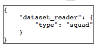

# Creating your Configuration File

AllenNLP experiments are driven by JSON-like configuration files.
One frequent piece of feedback we get is that it's difficult to know
just what needs to go in the configuration file. Accordingly, we've
built a couple of tools (that are still somewhat experimental)
to help you out.

## The Configuration Wizard

We have created a (very experimental) configuration wizard that runs in your browser. To launch it, just run

```
$ allennlp configure
serving Config Explorer at http://localhost:8123
```

and then go to [localhost:8123](http://localhost:8123) in your browser.


You can see the same fields and annotations as in the command line version.
(The comments are hidden as tooltips, mouse over the question mark button to see them).

Required fields have their names in black, while optional fields have their names in gray.
Required fields that are not completed are highlighted in red.

If you click on the dataset_reader's "CONFIGURE" button, a dropdown will appear:


with the same choices as before:


and if you select SquadReader again, a configurator for the dataset reader piece will appear:


Notice there is also a "X" button to remove the dataset reader configuration if you decide you don't want it.

As you fill in the configuration options, at the bottom of the page an actual JSON configuration
will update in real time:



You could, if you like, fill out the entire configuration using this wizard,
copy the generated JSON into a file, and then launch an experiment.

## Caveat

These features are experimental. In particular, the UI for the configuration wizard
should be thought of as a prototype and will certainly improve in the future.
