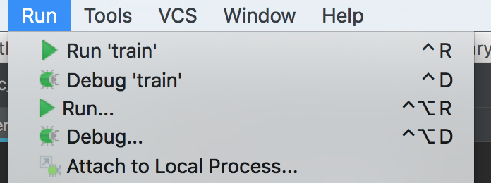
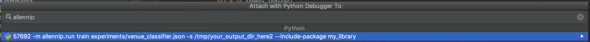
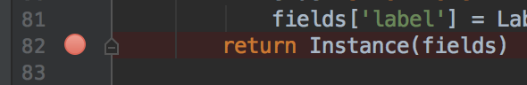
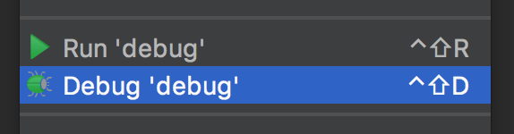
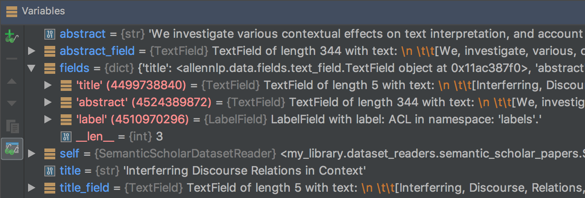

# How to Debug AllenNLP Using PyCharm

Recently several people have asked how to debug allennlp code
using PyCharm, so I set out to figure it out. It turns out that
it's not terribly difficult. If you have a different preferred
debugger, these instructions will probably work for you too.

# Some Code To Debug

We'll demonstrate the debugger using the Academic Paper Classifier model
from our ["AllenNLP-as-a-Library" example](https://github.com/allenai/allennlp-as-a-library-example).

If you'd like to follow along, clone that repo and install its requirements.

# How to Debug in PyCharm, Using "Run > Attach to Local Process"

Our recommended workflow is using our command-line tool `allennlp`.
The example repo contains the training command:

```
allennlp train experiments/venue_classifier.json -s /tmp/your_output_dir_here --include-package my_library -o '{"trainer": {"cuda_device": -1}}'
```

(I added an override to train on the CPU, since the machine you're running PyCharm on probably doesn't have a GPU.)

It turns out that `allennlp` is just (in essence) an alias for `python -m allennlp.run`, so you could equivalently do

```
python -m allennlp.run train experiments/venue_classifier.json -s /tmp/your_output_dir_here --include-package my_library -o '{"trainer": {"cuda_device": -1}}'
```

After which you can select "Run > Attach to Local Process",



search for the one that's running `allennlp`,



and get results in the debugger:


# How to Debug in PyCharm, Using "Run > Debug"

Some people find the "attach to local process" workflow to be a nuisance,
especially if you are repeatedly debugging things.

Fortunately, it's easy to launch the training process from code,
using `allennlp.commands.main()`.

First, create a wrapper script that puts your command-line args into `sys.argv` and calls `main()`. In the academic paper classifier example, I could use the following:

```python
import json
import shutil
import sys

from allennlp.commands import main

config_file = "experiments/venue_classifier.json"

# Use overrides to train on CPU.
overrides = json.dumps({"trainer": {"cuda_device": -1}})

serialization_dir = "/tmp/debugger_train"

# Training will fail if the serialization directory already
# has stuff in it. If you are running the same training loop
# over and over again for debugging purposes, it will.
# Hence we wipe it out in advance.
# BE VERY CAREFUL NOT TO DO THIS FOR ACTUAL TRAINING!
shutil.rmtree(serialization_dir, ignore_errors=True)

# Assemble the command into sys.argv
sys.argv = [
    "allennlp",  # command name, not used by main
    "train",
    config_file,
    "-s", serialization_dir,
    "--include-package", "my_library",
    "-o", overrides,
]

main()
```

Then you can set a breakpoint somewhere in your code:



Right-click in the editor and choose "Debug":



And then once you hit your breakpoint, you can inspect variables or step through code to your heart's content:



Happy debugging!
