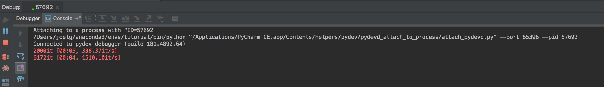

# How to Debug AllenNLP Using PyCharm

Recently several people have asked how to debug allennlp code
using PyCharm, so I set out to figure it out. It turns out that
it's not terribly difficult. If you have a different preferred
debugger, these instructions will probably work for you too.

# Some Code To Debug

We'll demonstrate the debugger using the Academic Paper Classifier model
from our ["AllenNLP-as-a-Library" example](https://github.com/allenai/allennlp-as-a-library-example).

If you'd like to follow along, clone that repo and install its requirements.

# How to Debug in PyCharm, Using "Run > Attach to Local Process"

Our recommended workflow is using our command-line tool `allennlp`.
The example repo contains the training command:

```
allennlp train experiments/venue_classifier.json -s /tmp/your_output_dir_here --include-package my_library
```

It turns out that `allennlp` is just (in essence) an alias for `python -m allennlp.run`, so you could equivalently do

```
python -m allennlp.run train experiments/venue_classifier.json -s /tmp/your_output_dir_here --include-package my_library -o '{"trainer": {"cuda_device": -1}}'
```

(The overrides is because you probably don't have a GPU).

After which you can select "Run > Attach to Local Process",


search for the one that's running `allennlp`,


and get results in the debugger:



# How to Debug in PyCharm, Using "Run > Debug"

Some people find "attach to process" to be a nuisance.
Fortunately, it's easy to launch the training process from code,
using `allennlp.commands.main()`.

First, create a wrapper script that puts your command-line args into `sys.argv` and calls `main()`:


Then you can set a breakpoint somewhere in your code:


Right-click in the editor and choose "Debug":


And then once you hit your breakpoint, you can inspect variables or step through code to your heart's content:


Happy debugging!
