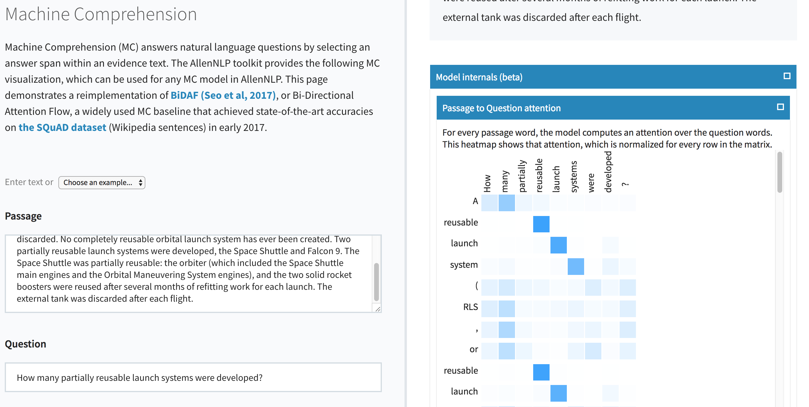
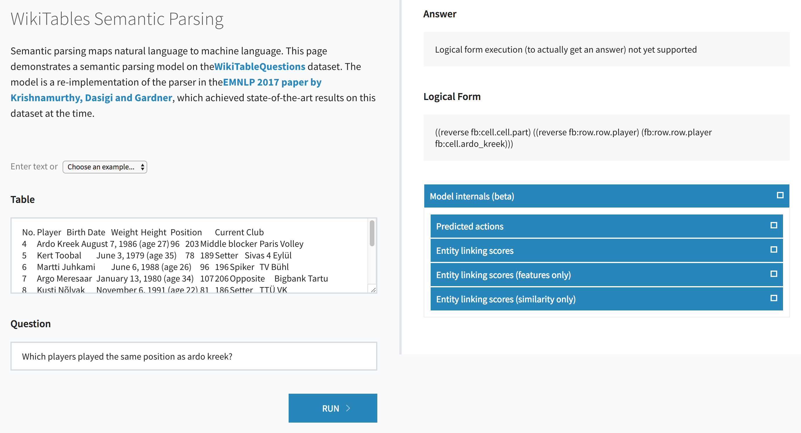
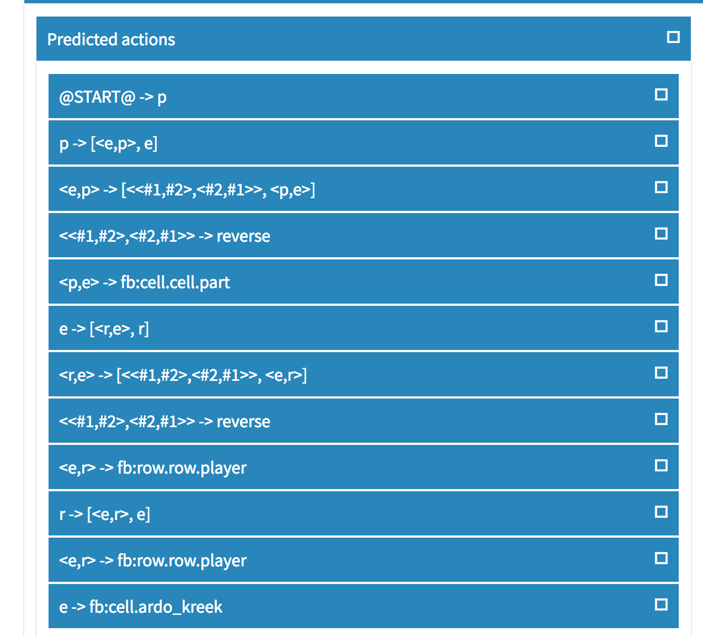
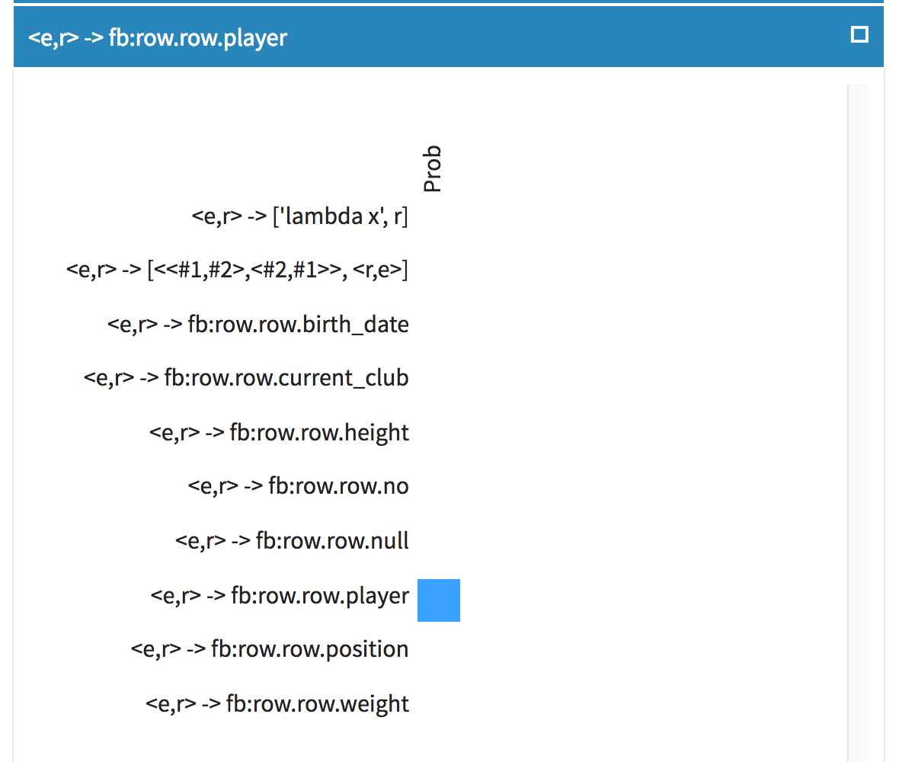
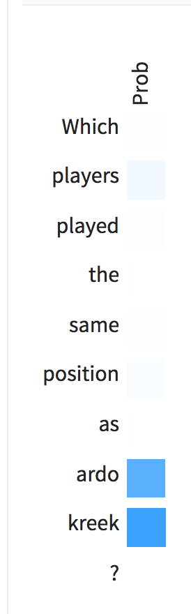
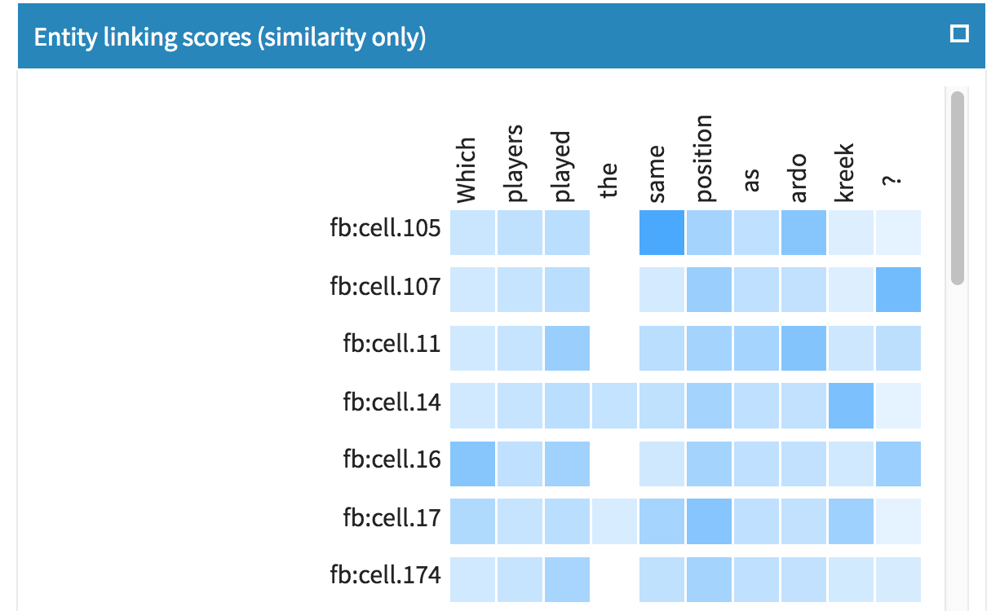

# Visualizing model internals in a live demo

We recently added an attention visualization to the live BiDAF demo on
[allennlp.org](https://demo.allennlp.org/machine-comprehension).  Here's what it looks like:

The basic components here are reusable, so you can relatively easily get a similar demo for
whatever model you're working on.  This is a little bit more involved than some of our other
how-tos, but if you're feeling adventurous, here's a guide to the changes you need to make to get a
live demo that shows model internals, which we've found to be very helpful for understanding what
parts of our models need fixing.

## Pre-requisites

1. You need to have a text-in-json-out demo of your model already running using our simple
   server. This demo server will act as a backend with which the react server will interact and produce results.
   See the [tutorial on creating a
demo](../getting_started/predicting_paper_venues/predicting_paper_venues_pt2.md) for how to do this.
2. We'll be using a React app to generate HTML and javascript for the fancier demo, so you need to
   have `npm` and `node.js` installed.  There are plenty of guides for how to install these on the
web, sometimes with one-line shell commands.  On MacOS with homebrew, you can just run `brew
install npm`.
3. Some vague familiarity with [React](https://reactjs.org) and how JSX components work would be
   helpful, but we've tried to make it super simple to modify the React components even if you've
never seen React before.  You'll need to use javascript syntax, but again, even if you're not
familiar with javascript, you should be able to get by with just making simple modifications to
what's there.

## Model plumbing

If your text in / text out demo already contains "text out" for all of the pieces of your model
you want to display in your demo, you can skip this section.  If not, keep reading.

You need the model to output whatever information you want to display.  We already return a
dictionary from `Model.forward` containing whatever keys you want; you just need to be sure the
things you want to visualize are in there (including actual strings instead of integers if you want
to have human-readable labels for the rows and columns of your visualizations).  For BiDAF, this
was straightforward (see https://github.com/allenai/allennlp/pull/692/files):

- We added `question_tokens` and `passage_tokens` fields to the metadata returned for each
  instance in the `DatasetReader`, which we use for column and row labels.
- We added the `passage_question_attention` tensor to the model's `output_dict`.  No change or
  anything required here, just add the tensor directly, and the library will sanitize it to a JSON
object containing lists of numbers for you.
- In `Model.decode` we made sure that the `question_tokens` and `passage_tokens` fields got passed
  along to the `output_dict` from the `metadata` we got from the `DatasetReader`.  There are other
ways of doing this without going through a `metadata` field (e.g., change the `Predictor` to
tokenize your data, and pass along the tokens there), but it was easiest this way with BiDAF.

That's all you have to change in the model.  All we need is to be able to get the right information
in the output dictionary from `model.forward()`, however you want to make that happen.

After you've made these changes in your model, you should be able to see the outputs you want to
visualize in the text output returned by the simple server you set up in the pre-requisites.

## Set up the React demo

We've [set up a repository](https://github.com/allenai/allennlp-simple-server-visualization) with a
stripped-down version of the code that runs the demo on
[demo.allennlp.org](https://demo.allennlp.org).  Clone that repository and copy the `demo/`
directory to wherever you want.  `cd` to that directory, and run `npm install`, then `npm start`.
That should show a screen in your terminal that says "Compiled successfully!", directing you to
view your demo in a browser at `localhost:3000`.  If you go there, you should see a page that says
"Your Model Name" and has some place-holder UI elements.

## Customize the React demo

The demo code that you copied above has two files that you need to modify to make your demo work:
`src/ModelInput.jsx` and `src/ModelOutput.jsx`.  `ModelInput.jsx` renders the left half of the
screen, where you give inputs to the model, and `ModelOutput.jsx` renders the right half of the
screen with the output of your model after you click on the "Run" button.

### Modifying ModelInput.jsx

There are six `TODOs` in `ModelInput.jsx`, showing all of the places you might want to modify to
get your demo hooked up correctly.  These modifications include changing the input elements to
accept the inputs that your model expects, adding some canned examples that are easy to run in
your demo, and giving a title and description for your model.  The most important point to make
sure of is that the keys to the dictionary you pass to the `runModel` function match the keys that
your model expects to receive in `predict_json`.

Once you've modified these, you can check that you've done it correctly by clicking "Run" with an
example and making sure that your simple server receives and can respond to the request.  You
should be running the simple server on port 8000 (which is the default), and you should see the
server log a `POST` request, with a response code `200`.  If you see an error on your server at
this point, you haven't hooked up your variable names correctly.  Note that the right side of the
page won't render properly yet, and the javascript will probably crash.  That's fine, just make
sure the backend server worked and refresh the page - we'll fix the output next.

### Modifying ModelOutput.jsx

There are only two `TODOs` in `ModelOutput.jsx` that indicate places you need to modify.  These
pieces pull out the variables you want to visualize from the `outputs` JSON returned by your
model, and then display those variables with fancy components.  We've given examples for
visualizing text fields and attention maps (both 1D and 2D); if you want to see other kinds of
output, you can add whatever React components or raw HTML that you want here.

After you've fixed `ModelOutput.jsx` to render the actual outputs from your model, that's it,
you're done!  You should be able to run your demo end-to-end, entering text on the left side of
the page, and seeing your results on the right side of the page.  Happy demoing!

## More general uses

The basic outline here is quite general and allows for visualizing all kinds of model internals.
You just need to make sure your model outputs the internal state you want to visualize, and that
the demo code passes that information from the JSON response to the proper React component.

We've used this to visualize the internal workings of an action-based semantic parser.  The parser
is not quite ready for public consumption, so the code and demo are not yet available, but here's
a sneak peak of what you can do with this kind of model visualization:

||
|:--:|
| *The main (still rough) parser UI, with model internals* |

||
|:--:|
| *The sequence of predicted actions that generated the logical form above* |

||
|:--:|
| *At each output step, we show the considered actions and their probabilities* |

||
|:--:|
| *At each output step, we also show the model's attention over the question* |

||
|:--:|
| *Before decoding, we compute a linking between table entities and question words. This shows part of that linking.* |
